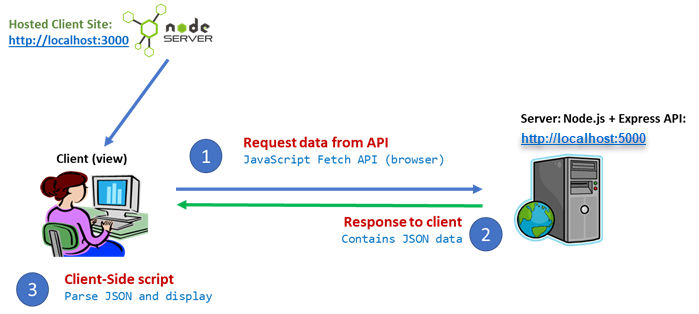
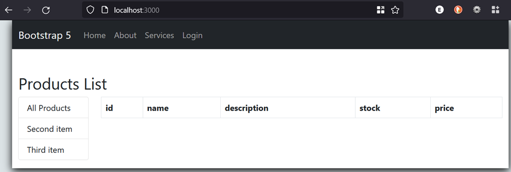
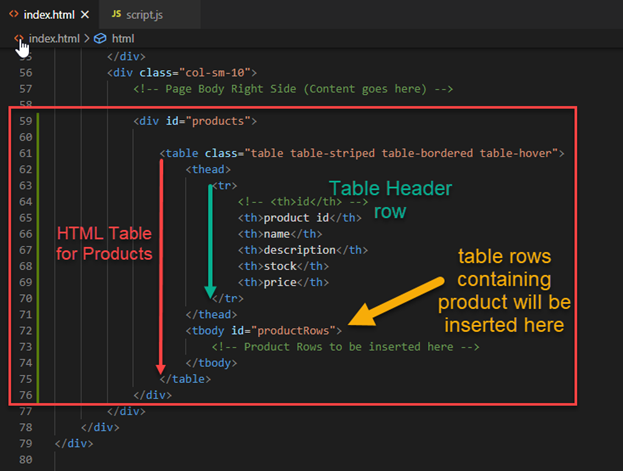
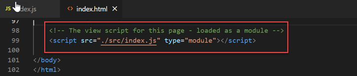
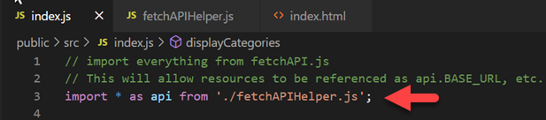
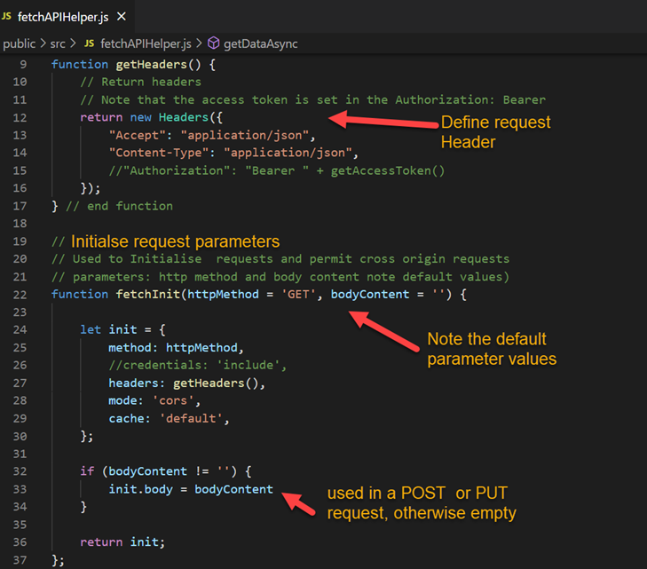
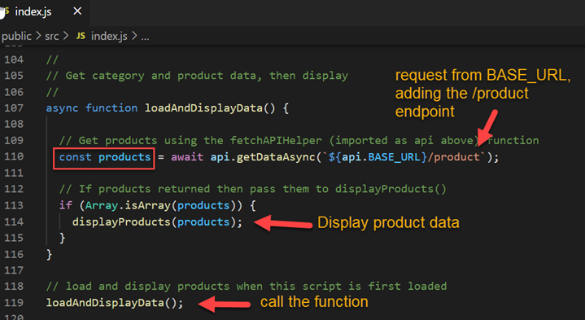
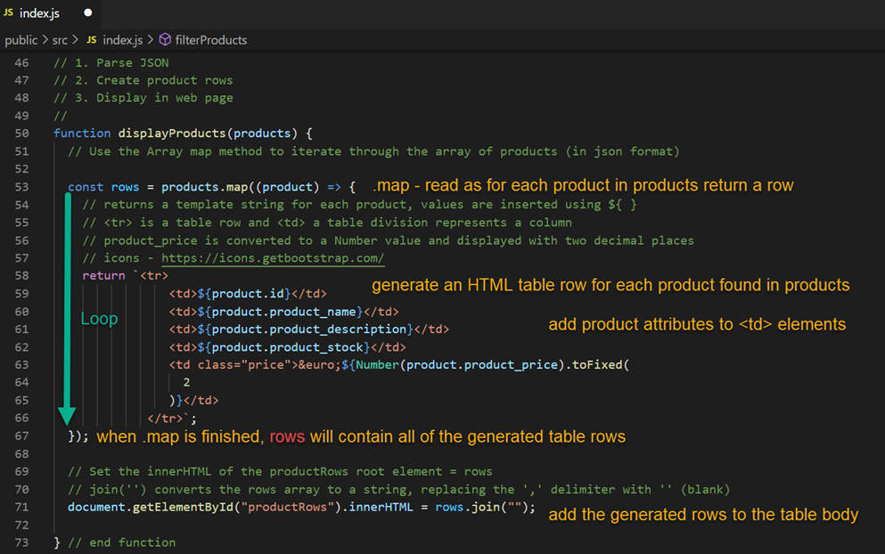
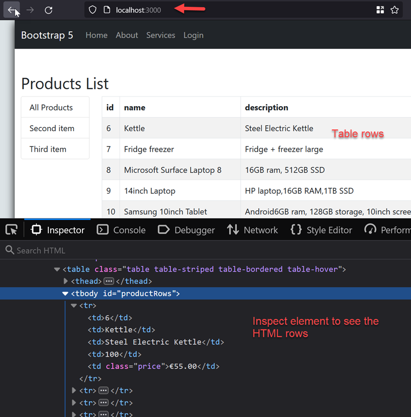

# Web API Client: Part 1 - display products

Enda Lee 2022

### Quick Start

1. Make sure the `Server API` app is running on http://localhost:5000
2. Download the start site from this repository.
3. Open in VS Code (separate to the server API instance).
4. In a terminal run `npm install`.
5. Start the application using `npm run start`.


## Introduction

This tutorial will create a client website which uses the JavaScript Fetch API to request and display data from the web API created previously.




## Pre-requisites

The application will use **separate** **`client`** and **`server`** applications which should be opened in separate VS Code instances when working on this lab.

##### Server-side

The client functionality is dependent on a server API with Category and Product endpoints.

Start with the completed server API to date:

https://github.com/elee-tudublin/2022.SSWD_5.1_Web-API_Database_Part2


##### Client-side:

Start with the code from this repository which should be downloaded and opened in VS Code.


## Getting Started

This start site includes `Bootstrap`, etc. Content from the `public folder` is `served` by NodeJS and can be accessed via

http://localhost:3000


The client site/ application will fetch its data from the server-side API running on http://localhost:5000


## Retrieve and Display Data

#### 1. index.html

When index.html loads first, it is empty and looks like this: 




After the products are retrieved, they will be displayed in the `HTML table`. Open `index.html` to see the table. The table body, which has `id="productRows"` will be populated using `JavaScript`. The product data will be requested from the API.




Near the end of ```index.html``` you will see that the script ```./src/index.js``` is loaded. This script is responsible for retrieving and displaying data when the client app is loaded. This section describes the process in detail.




#### 2. Retrieving Data - `index.js` and `fetchHelper.js` 

 ```index.js```  starts by importing `./fetchAPIHelper.js`, which contains the data access functions. 




The **`fetchAPIHelper.js`** script is used to keep share the common functions and settings used to retrieve data from the API. This avoids the need to write this code whenever data is required, while making the application easier to maintain.

1. `BASE_URL` defines the server address.

   


2. Generate request Header.

   

   

3. The `getDataAsync()` function.

   


#### 3. index.js - Display Products -  `loadAndDisplayData()`

The function calls required to get and display data are made in the `loadAndDisplayData()` function, near the end of `index.js`. This function uses `getDataAsync()` to retrieve data and then display it.




#### 4. Adding product data to the page

The final step is to display the product data using the `displayProducts(products)`. The function function parses the json data, generates the HTML table rows, and adds them to the `HTML table` described earlier.

The function creates a table row for each event and then adds the rows to the ```productRows``` element in ```index.html``` - remember that ```productRows``` references the ```<tbody>``` section of the events table.

```const rows = products.map(product=> { // return a row });``` can be read as **return** a html table row *for each* ```product``` found in ```products```. 

The return statement builds the row from ```HTML``` and the attribute values for a ```product```.  is finished, rows.




## Test the Application

First **open and start the server API app**, so that it is running and ready for http connections.

In a web browser, open http://localhost:3000. The page should load and display the data.

Check for details in the browser console where you will say the result of any logging, errors, etc.




## Exercises:

Following the example above, add the functionality required to:

1. Show the categories in the left menu (replacing first item, etc.).
2. Add code so that when a category is clicked the product list is updated to show only products from that category.
3. Add a menu item to the category list to display all products when clicked.
4. Add the code etc. to display the details for a single product when a product name is clicked. Display the product details in a new section under the products table.
5. Use a Bootstrap Modal form to display the single product details, see https://getbootstrap.com/docs/5.0/components/modal/


------

Enda Lee 2022
